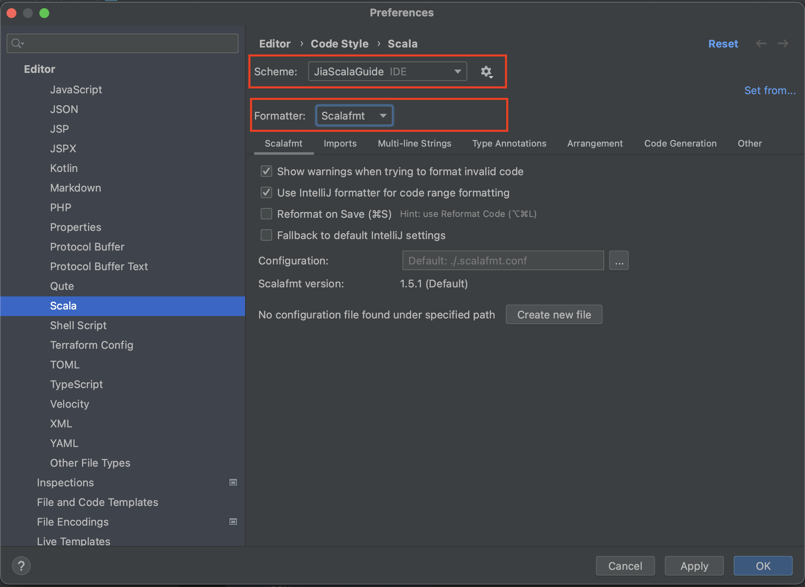

# How to Build this Project

## Prerequisites

Minimum requirements for running the service locally

- Access to [Jia JFrog](https://jiaco.jfrog.io/)

### JFrog Credentials

In order to load shared libraries from JFrog, add artifactory credentials file to
your `~/.ivy2/.credentials`:

```
realm=Artifactory Realm
host=jia.jfrog.io
user=PutYourUserNameHere
password=PutYourPasswordOrAccessKeyHere
```

If you don't have Artifactory credentials, ask your manager to grant you access.

## Setting up the project with IntelliJ IDEA (Optional)

- Clone the project repository from GitHub using the
  command `git clone git@github.com:jia-eng/scala-tools-common.git`
- Download [IntelliJ](https://www.jetbrains.com/idea/download) (Ask your manager for a license if
  you need one)
- Ensure that you have the following IntelliJ plugins installed
    - [Scala](https://plugins.jetbrains.com/plugin/1347-scala)
- Create a new project in IntelliJ `File -> New -> Project from Existing Sources...`
- Make sure to load the
  correct [styleguide](
  https://jia-co.atlassian.net/wiki/spaces/ENGINEERIN/pages/196707/Coding+standards#Code-styles)
  for this project and enable `scalafmt` as shown below 

## Compiling

- Make sure to have `Scala` and `sbt` installed locally
- Run the application using the command
  ```shell script
  sbt clean compile
  ```

## Running Unit and Integration Tests

- Setup
    - Docker
        - Start Docker test resources by running the command
         ```shell
         deployment/docker-compose.sh up
         ```
        - Source environment variables required to facilitate running tests against the Docker
          resources
         ```shell
         source deployment/utils/local_verification_envars.sh
         ```
    - No Docker
        - Correctly provide values for the environment variables specified
          in `deployment/utils/local_verification_envars.sh`
- Test a specific class using
   ```shell script 
    sbt "testOnly *MySpec*"
   ```
- Test the entire service using
   ```shell script 
    sbt clean test
   ```
- Test with coverage report
   ```shell script 
    sbt clean coverage test coverageReport coverageAggregate
   ```

## Publishing

- publish to your local

  ``` 
  sbt clean compile package publishLocal
  ```                     

- publish to Artifactory (SNAPSHOT)

  ``` 
  sbt clean compile package publish
  ```

- publish to Artifactory (RELEASE)
  ```
  sbt "release with-defaults"  
  ```

Notes:

- SNAPSHOT artefacts can be published as many times as you wish
- RELEASE artefact can only be published once

## Troubleshooting

### Kafka tests are failing due to network errors

- Confirm that Kafka dependencies were successfully started. They have a tendency to not start
  successfully sometimes.
- You can restart the dependencies one at a time using the commands below
  ```shell
  $ docker restart tools-common-zookeeper
  $ docker restart tools-common-kafka-broker0
  $ docker restart tools-common-schema-registry
  $ docker restart tools-common-kafka-setup
  ```

### Kafka tests are failing due to serialization errors

- It is possible that the schema registry did not start up correctly. Restart is using the command
  below;
  ```shell
  $ docker restart tools-common-schema-registry 
  ```
